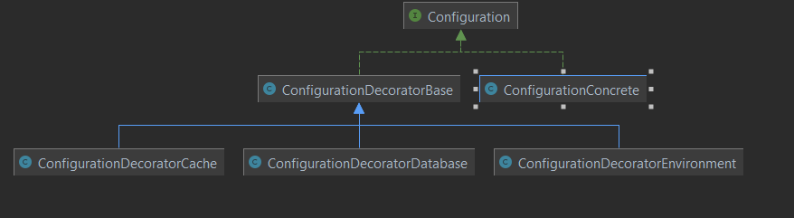

# Technical test for Andrei Manolache

## Please make sure to read all of this documentation

## Quick notes for setting up this project:
- The project isn't dockerized, I work on windows and for some reason WSL2 was throwing a fit and shutting down sporadically. I'll troubleshoot it in my own time since I wanted to deliver this project in a timely manner.
- Please make sure you have php installed
- Please make sure you have composer installed
- please run composer install to obtain all the packages including PHPUnit
- I simply ran the project with this command : `php -S localhost:8000`
- To run the tests just run `./vendor/bin/phpunit tests`

## Design choices 

- I assumed the required parameters for the config file are : `environment`, `database`, `cache`
- In certain environments like production it's very dangerous if during a config switches certain parameters are not present(like the DB) so this test application has defaults set for each essential config section (environment/database/cache)
- For writing the config file we used the Decorator pattern. You can see this by observing the Configuration*.php set of classes in /App/Models
 
 
  


- I have broken down each functionality (Read, validate, log, etc) into separate units so they can be individually tested and also respect the Single Responsibility Principle

- If we want to expand the functionality to another type of file than JSON the only thing needed to do is to create new reader/validator/writer classes that implement the corresponding interfaces

## Where to find everything? 

- the `JsonConfigReader` in `./App/Lib/JsonFileReader` represents the parsing functionality that looks up a specific section of the config file for the user. 
It can be used the following way if initialized in a class: 
  
  ```$this->configReader->readConfig('cache.redis.host')```
  if the user wants to return the host of the redis of the cache section of the config
  

- the `JsonFileWriter` is the class responsible of saving new configs to the  project's config file. It consumes an array of filepaths and adds the data contained to the current config file, overriding only what's necessary. If our config file contains an `environment`, a `database` and a `cache` and the json files we're consuming only tackles the `cache` and the `database`, the `environment` doesn't change.
This class can be called the following way: 
  ```            $test = $this->fileWriter->writeConfigFile(['pathToFile1', 'pathToFile2'.....]); ```


- in the `JsonFileWriter` I have also used a class that I called `JsonFileValidator` that checks if the Json file is valid. It can be called the following 2 ways:
 
```$this->fileValidator->validateFile($filepath);```
  

```$this->fileValidator->validateFileContent($filecontent);```

- Additionally if some files are valid and some are not, the system logs the invalid ones and only applies the valid changes. 

## The Playground

- so I know that in addition to all of the unit tests you guys might want to play around with this project a bit so I left the `App/Controller/FileParsingDemo.php` file there with a couple of injections so you can play around with the project and try and break it in many different ways.
- This page can simply be accessed by going to `http://localhost:8000/`

## Quick notes about the project itself

- One of the more interesting design patterns that were discussed in the interview with Mr. Nuno Costa was the Decorator pattern so I thought it would be a fun idea trying to implement that into this project. This is both as a learning experience to myself and to show my capacity of picking up new information and using it in a professional context

- I like loggers to just know what's going on and if anything breaks or if
  someone wants to access my page so I also added a logger in the Lib
  
- To save some time on most projects (coding tests/pure php projects etc)
  I do tend to reuse a project skeleton for the routing and the logging and I feel it's nice just having a ready to go project to start coding tests on. 
  

Don't hesitate to contact me at andrei.r.manolache@gmail.com for
further details on this

